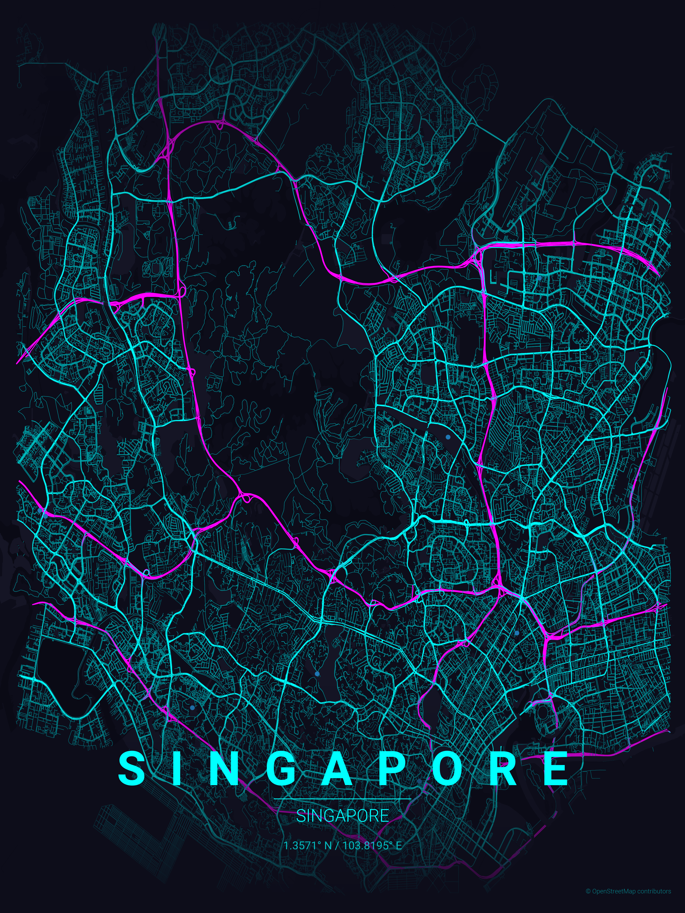
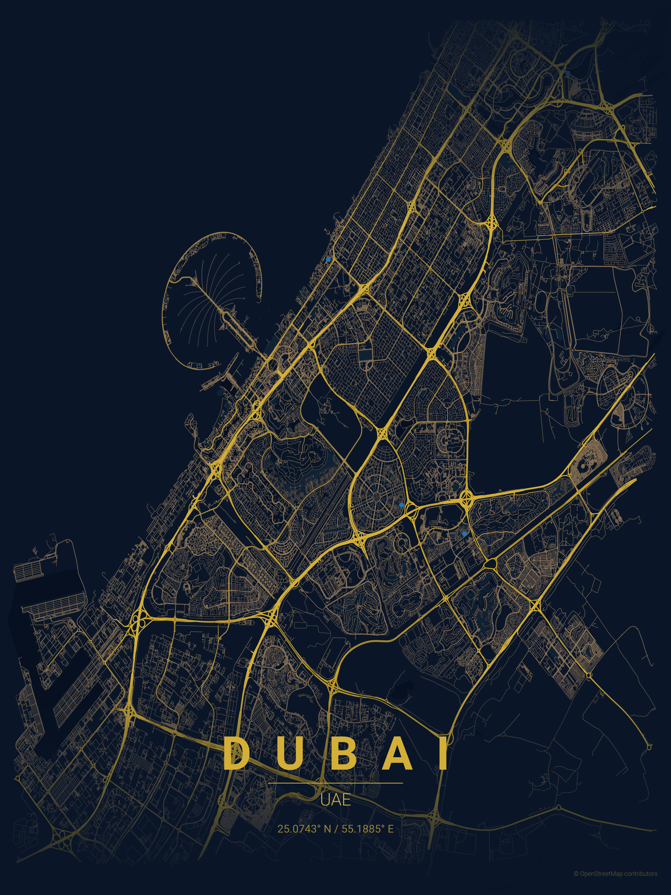
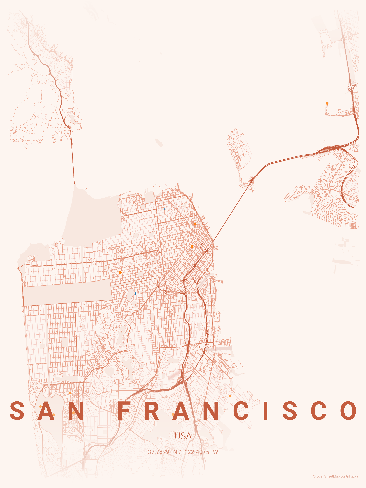
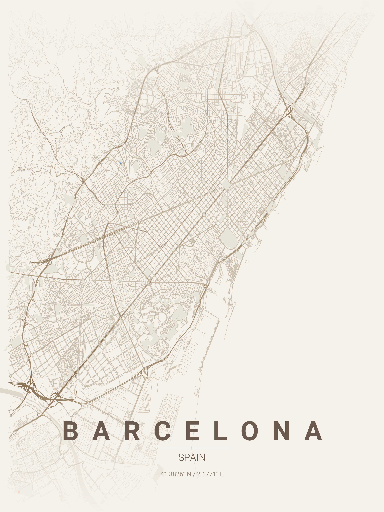
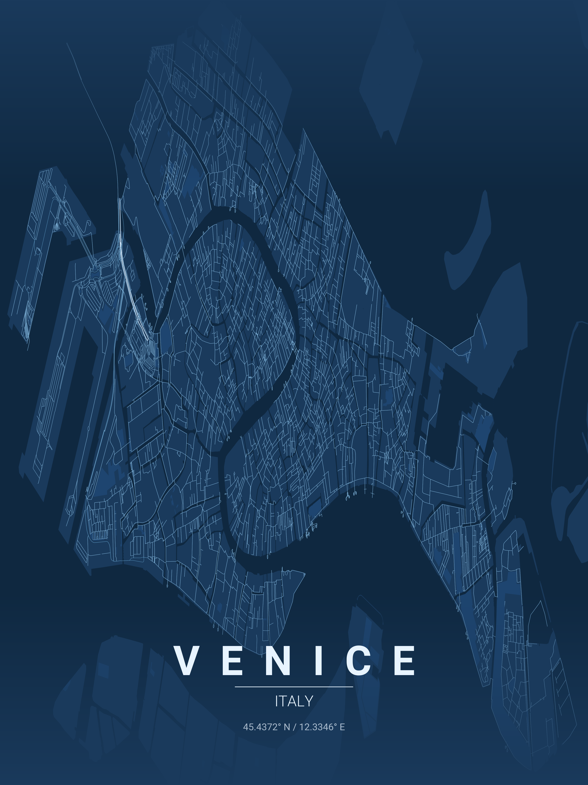
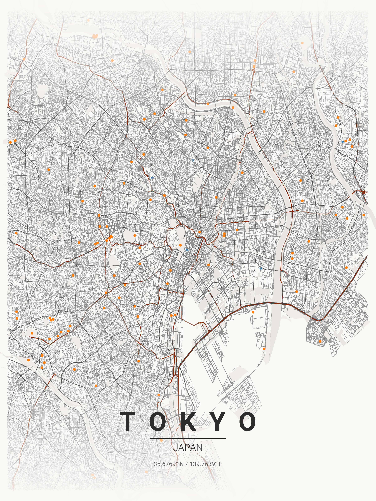
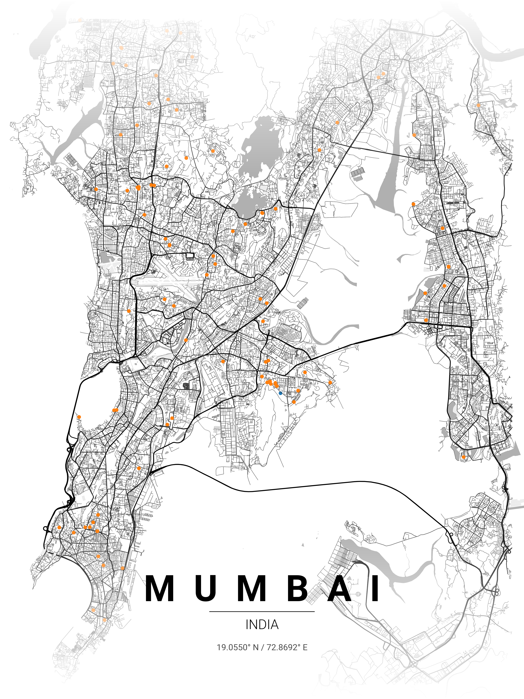
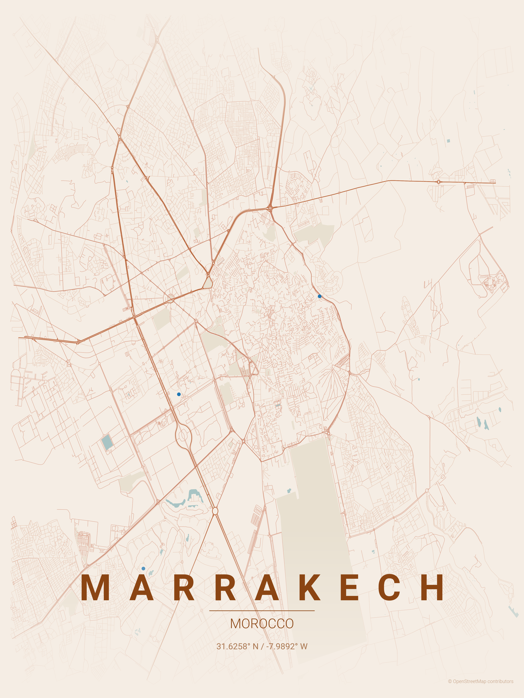
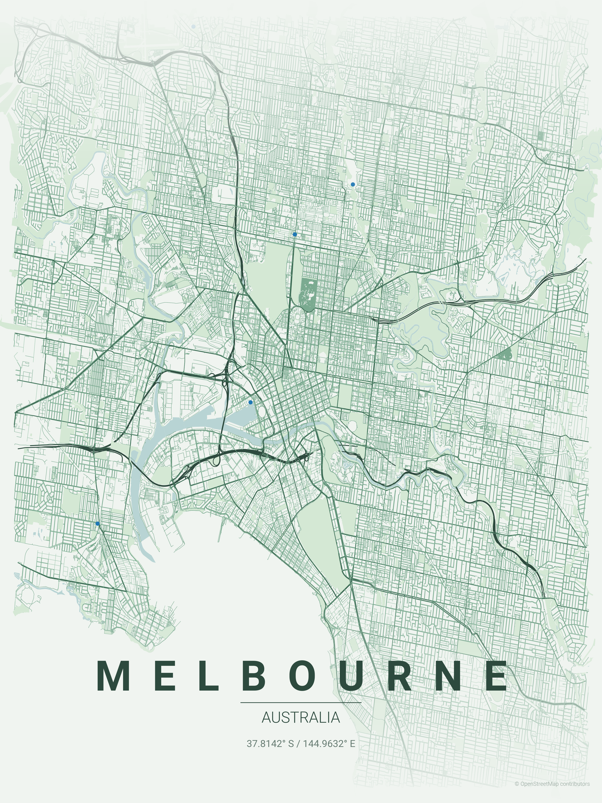

# 城市地图海报生成器

为世界任何城市生成精美极简风格的地图海报。




## 示例

| 国家 | 城市 | 主题 | 海报 |
|:------------:|:--------------:|:---------------:|:------:|
| 美国 | 旧金山 | sunset |  |
| 西班牙 | 巴塞罗那 | warm_beige |  |
| 意大利 | 威尼斯 | blueprint |  |
| 日本 | 东京 | japanese_ink |  |
| 印度 | 孟买 | contrast_zones |  |
| 摩洛哥 | 马拉喀什 | terracotta |  |
| 新加坡 | 新加坡 | neon_cyberpunk |  |
| 澳大利亚 | 墨尔本 | forest |  |
| 阿联酋 | 迪拜 | midnight_blue |  |

## 安装

```bash
pip install -r requirements.txt
```

## 使用方法

```bash
python create_map_poster.py --city <城市> --country <国家> [选项]
```

### 命令行参数

| 参数 | 短参数 | 描述 | 默认值 |
|------|--------|------|--------|
| `--city` | `-c` | 城市名称 | 必需 |
| `--country` | `-C` | 国家名称 | 必需 |
| `--theme` | `-t` | 主题名称 | feature_based |
| `--distance` | `-d` | 地图半径（米） | 29000 |
| `--ratio` | `-r` | 画幅比例（宽:高） | 1:1 |
| `--landmark` | `-l` | 地标名称 | 无 |
| `--coords` | | 自定义坐标 "lat,lon" | 无 |
| `--stretch` | `-s` | 拉伸模式标志 | 无 |
| `--list-themes` | | 列出所有主题 | |

### 使用示例

```bash
# 经典网格格局
python create_map_poster.py -c "New York" -C "USA" -t noir -d 12000           # 曼哈顿网格
python create_map_poster.py -c "Barcelona" -C "Spain" -t warm_beige -d 8000   # 塞尔达区块

# 水岸与运河
python create_map_poster.py -c "Venice" -C "Italy" -t blueprint -d 4000       # 运河网络
python create_map_poster.py -c "Amsterdam" -C "Netherlands" -t ocean -d 6000  # 同心圆运河
python create_map_poster.py -c "Dubai" -C "UAE" -t midnight_blue -d 15000     # 棕榈岛与海岸线

# 放射状格局
python create_map_poster.py -c "Paris" -C "France" -t pastel_dream -d 10000   # 奥斯曼大道
python create_map_poster.py -c "Moscow" -C "Russia" -t noir -d 12000          # 环形公路

# 有机老城
python create_map_poster.py -c "Tokyo" -C "Japan" -t japanese_ink -d 15000    # 密集有机街道
python create_map_poster.py -c "Marrakech" -C "Morocco" -t terracotta -d 5000 # 麦地那迷宫
python create_map_poster.py -c "Rome" -C "Italy" -t warm_beige -d 8000        # 古老布局

# 沿海城市
python create_map_poster.py -c "San Francisco" -C "USA" -t sunset -d 10000    # 半岛网格
python create_map_poster.py -c "Sydney" -C "Australia" -t ocean -d 12000      # 海港城市
python create_map_poster.py -c "Mumbai" -C "India" -t contrast_zones -d 18000 # 沿海半岛

# 河流城市
python create_map_poster.py -c "London" -C "UK" -t noir -d 15000              # 泰晤士河曲线
python create_map_poster.py -c "Budapest" -C "Hungary" -t copper_patina -d 8000  # 多瑙河分界

# 自定义画幅比例 (16:9 横屏)
python create_map_poster.py -c "Chengdu" -C "China" -t midnight_blue -r 16:9

# 地标定位
python create_map_poster.py -c "Beijing" -C "China" -t noir -l "Tiananmen Square"

# 自定义坐标
python create_map_poster.py -c "Beijing" -C "China" -t noir --coords "39.91,116.40"

# 列出所有主题
python create_map_poster.py --list-themes
```

### 距离参考指南

| 距离 | 适用场景 |
|------|----------|
| 4000-6000m | 小型/密集城市（威尼斯、阿姆斯特丹中心区） |
| 8000-12000m | 中等城市、聚焦市中心（巴黎、巴塞罗那） |
| 15000-20000m | 大都市、完整城市视图（东京、孟买） |

## 17种主题

| 主题名称 | 风格描述 |
|:---------|:---------|
| `feature_based` | 经典黑白风格，道路层次分明 |
| `gradient_roads` | 平滑渐变阴影 |
| `contrast_zones` | 高对比度城市密度 |
| `noir` | 纯黑背景配白/灰道路，现代画廊美学 |
| `midnight_blue` | 深海军蓝背景配金/铜色道路，奢华地图集美学 |
| `blueprint` | 经典建筑蓝图，技术绘图美学 |
| `neon_cyberpunk` | 深色背景配电光粉/青色，大胆夜城氛围 |
| `warm_beige` | 温暖中性调配棕褐色，复古地图美学 |
| `pastel_dream` | 柔和粉彩配灰蓝和淡紫，梦幻艺术美学 |
| `japanese_ink` | 传统水墨风格，极简主义配微红点缀 |
| `forest` | 深绿和鼠尾草色调，有机植物美学 |
| `ocean` | 多种蓝色和青色，完美适合沿海城市 |
| `terracotta` | 地中海温暖，焦橙和陶土色调配奶油底 |
| `sunset` | 温暖橙色和粉色配柔桃色，梦幻黄金时刻 |
| `autumn` | 焦橙、深红、金黄，季节温暖 |
| `copper_patina` | 氧化铜美学，青绿锈层配铜色点缀 |
| `monochrome_blue` | 单一蓝色家族配不同饱和度，干净连贯 |

## 输出格式

海报保存至 `posters/` 目录，格式：
```
{城市}_{主题}_{YYYYMMDD_HHMMSS}.png
```

## 添加自定义主题

在 `themes/` 目录创建 JSON 文件：

```json
{
  "name": "My Theme",
  "description": "主题描述",
  "bg": "#FFFFFF",
  "text": "#000000",
  "gradient_color": "#FFFFFF",
  "water": "#C0C0C0",
  "parks": "#F0F0F0",
  "road_motorway": "#0A0A0A",
  "road_primary": "#1A1A1A",
  "road_secondary": "#2A2A2A",
  "road_tertiary": "#3A3A3A",
  "road_residential": "#4A4A4A",
  "road_default": "#3A3A3A"
}
```

## 项目结构

```
maptoposter/
├── create_map_poster.py    # 主程序脚本
├── themes/                 # 主题 JSON 文件
├── fonts/                  # Roboto 字体文件
├── posters/                # 生成的海报
└── cache/                  # 缓存目录
```

## 最近修改 (2025-01-19)

- **API超时修复** - 超时时间从1秒增加到10秒
- **坐标定位优化** - 优先选择城市级结果，修复大城市定位偏移问题
- **自定义画幅功能** - 新增 `--ratio` 参数支持任意比例

## 技术细节

### 架构概览

```
┌─────────────────┐     ┌──────────────┐     ┌─────────────────┐
│   CLI 解析器    │────▶│  地理编码    │────▶│   数据获取      │
│   (argparse)    │     │  (Nominatim) │     │    (OSMnx)      │
└─────────────────┘     └──────────────┘     └─────────────────┘
                                                      │
                         ┌──────────────┐             ▼
                         │    输出      │◀────┌─────────────────┐
                         │  (matplotlib)│     │   渲染          │
                         └──────────────┘     │  (matplotlib)   │
                                              └─────────────────┘
```

### 关键函数

| 函数 | 用途 | 修改时机 |
|------|------|----------|
| `get_coordinates()` | 通过 Nominatim 将城市转为坐标 | 更换地理编码服务 |
| `create_poster()` | 主渲染流程 | 添加新地图图层 |
| `get_edge_colors_by_type()` | 根据 OSM highway 标签着色 | 修改道路样式 |
| `get_edge_widths_by_type()` | 根据重要性设置道路宽度 | 调整线条粗细 |
| `create_gradient_fade()` | 顶部/底部渐变效果 | 修改渐变覆盖层 |
| `load_theme()` | JSON 主题转为字典 | 添加新主题属性 |

### 渲染层级 (z-order)

```
z=11  文字标签（城市、国家、坐标）
z=10  渐变效果（顶部和底部）
z=3   道路（通过 ox.plot_graph）
z=2   公园（绿色多边形）
z=1   水域（蓝色多边形）
z=0   背景色
```

### OSM 道路类型 → 道路层级

```python
# 在 get_edge_colors_by_type() 和 get_edge_widths_by_type() 中
motorway, motorway_link     → 最粗 (1.2)，最深色
trunk, primary              → 粗 (1.0)
secondary                   → 中等 (0.8)
tertiary                    → 细 (0.6)
residential, living_street  → 最细 (0.4)，最浅色
```

### 添加新功能

**新地图图层（如铁路）：**
```python
# 在 create_poster() 中，获取公园后：
try:
    railways = ox.features_from_point(point, tags={'railway': 'rail'}, dist=dist)
except:
    railways = None

# 然后在道路前绘制：
if railways is not None and not railways.empty:
    railways.plot(ax=ax, color=THEME['railway'], linewidth=0.5, zorder=2.5)
```

**新主题属性：**
1. 添加到主题 JSON：`"railway": "#FF0000"`
2. 在代码中使用：`THEME['railway']`
3. 在 `load_theme()` 默认字典中添加回退值

### 文字定位

所有文字使用 `transform=ax.transAxes`（0-1 归一化坐标）：
```
y=0.14  城市名称（字间距）
y=0.125 装饰线
y=0.10  国家名称
y=0.07  坐标
y=0.02  来源标注（右下角）
```

### OSMnx 常用模式

```python
# 获取所有建筑
buildings = ox.features_from_point(point, tags={'building': True}, dist=dist)

# 获取特定设施
cafes = ox.features_from_point(point, tags={'amenity': 'cafe'}, dist=dist)

# 不同网络类型
G = ox.graph_from_point(point, dist=dist, network_type='drive')  # 仅道路
G = ox.graph_from_point(point, dist=dist, network_type='bike')   # 自行车道
G = ox.graph_from_point(point, dist=dist, network_type='walk')   # 步行道
```

### 性能提示

- 大 `dist` 值 (>20km) = 下载慢 + 内存占用高
- 本地缓存坐标以避免 Nominatim 速率限制
- 使用 `network_type='drive'` 而非 `'all'` 以加快渲染
- 将 `dpi` 从 300 降至 150 以快速预览
